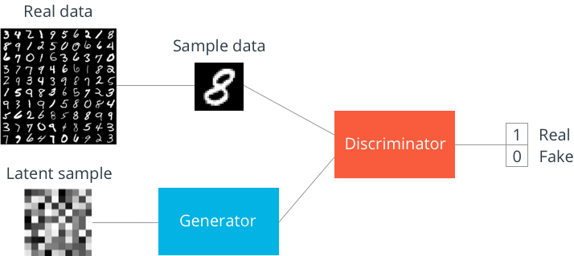
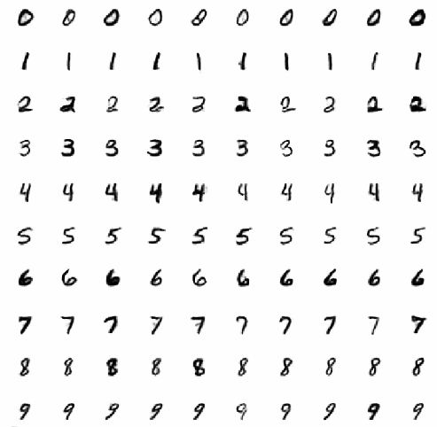

# Auxiliary Classifier GAN
GAN was first introduced in 2014 by Ian J. Goodfellow in the paper [Generative Adversarial Networks](https://arxiv.org/abs/1406.2661). In this paper, they created a framework for generating images by training two adversary models. One of them is G, which is responsible for creating an image with the given a noise vector (for creating a different image each time). Also, a D model which determines the images are real or fake, which do this by comparing the generated images with the real ones. Then, models are trained using the loss generated from the discriminator.

|  | 
|:--:| 
| *The structure of GAN* |

However, generating images with Deep Neural Network does not yield the best result. One way of improving the GAN framework is by adding convolutional layers to it, which was done in the article [Unsupervised Representation Learning with Deep Convolutional Generative Adversarial Networks](https://arxiv.org/abs/1511.06434). 

|  | 
|:--:| 
| *The structure of DCGAN* |

Another point is that the GAN framework by itself does not provide a way to generate custom images. So one way to add structure to the generated output is by adding a classifier model. So that the generator will be trained with the combined loss of the classifier and the discriminator, but still there is one problem. We have to have some inputs to the generator to determine the generated image should belong to which category. 

So in this project, I implemented the Auxiliary Classifier GAN using the DCGAN architecture.

|  | 
|:--:| 
| *Training results after each of 20 epochs* |

## Reference
[Keras GAN for MNIST Github Code](https://github.com/Zackory/Keras-MNIST-GAN)
